Adam Kelly LIS4761 HW1: Visualization Homework-- Air Quality Analysis
================

This project utilizes the default R dataset 'airquality' containing the following variables:

-   Ozone: Mean ozone in parts per billion from 1300 to 1500 hours at Roosevelt Island

-   Solar.R: Solar radiation in Langleys in the frequency band 4000--7700 Angstroms from 0800 to 1200 hours at Central Park

-   Wind: Average wind speed in miles per hour at 0700 and 1000 hours at LaGuardia Airport

-   Temp: Maximum daily temperature in degrees Fahrenheit at La Guardia Airport. \_\_\_\_\_\_\_\_\_\_\_\_\_\_\_\_\_\_\_\_\_\_\_\_\_\_\_\_\_\_\_\_\_\_\_\_\_\_\_\_\_\_\_\_\_\_\_\_\_\_\_\_\_\_\_\_\_\_\_\_\_\_\_\_\_\_\_\_\_\_\_\_\_\_\_\_\_\_\_\_\_\_\_\_\_\_\_\_\_\_\_\_\_

First the data is cleaned (fixing NA's or invalid data)

``` r
library(ggplot2)
library(reshape2)
library(lubridate)
library(tidyr)
library(plyr)

air = data.frame(airquality)

for(i in 1:ncol(air)){
  air[is.na(air[,i]), i] <- mean(air[,i], na.rm = TRUE)
}
```

Next are visualizations showing the different variables in our dataset.

``` r
ggplot(air, aes(air$Ozone))+geom_histogram()
```

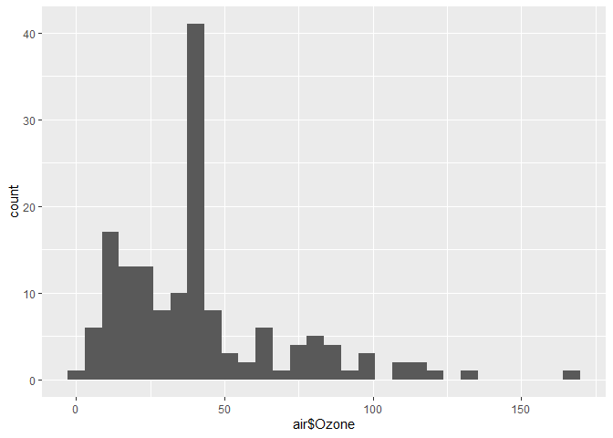

``` r
ggplot(air, aes(air$Solar.R))+geom_histogram()
```


``` r
ggplot(air, aes(air$Wind))+geom_histogram()
```

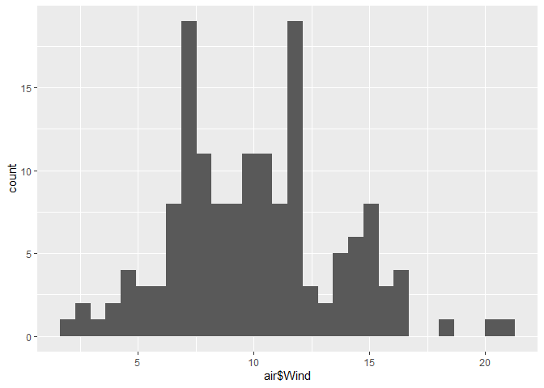

``` r
ggplot(air, aes(air$Temp))+geom_histogram()
```

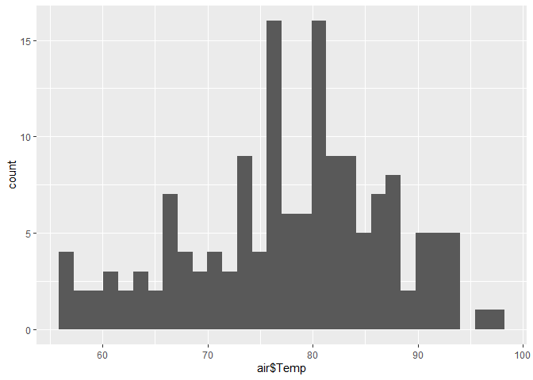

``` r
ggplot(air, aes(air$Month))+geom_histogram()
```

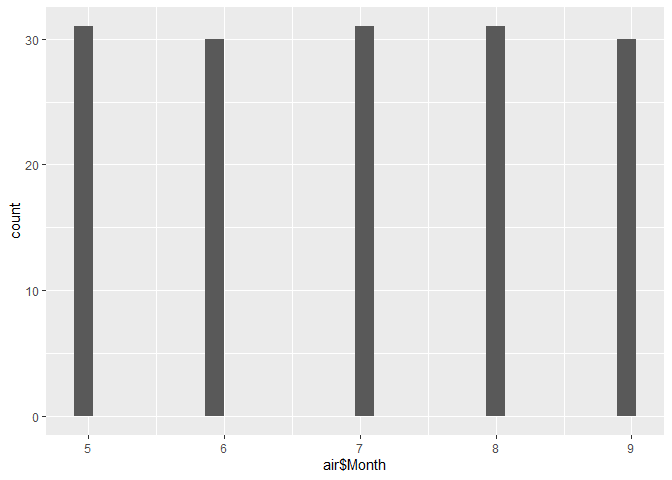

``` r
ggplot(air, aes(air$Day))+geom_histogram()
```

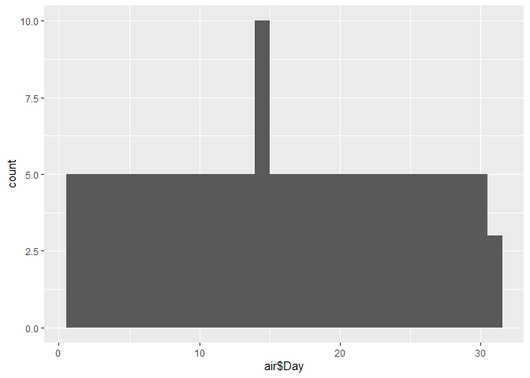

A boxplot to give a different visualization using variables Ozone and Wind.

``` r
ggplot(air, aes(air$Ozone, air$Wind, group = factor(0)))+geom_boxplot()+xlab("Air Ozone (Mean in Parts per Billion)")+ylab("Air Windspeed (mph)")
```

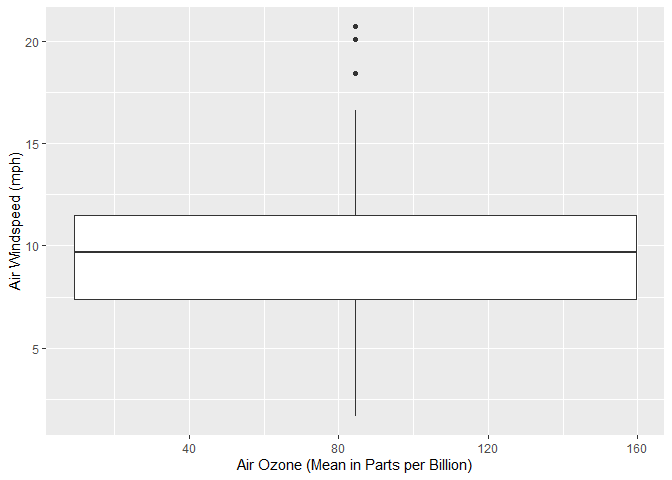

We then take our Month and Day columns and convert them to a date table format - this data is from the year 1973.

``` r
dates = as.Date(with(air, paste(Month, Day,sep="-")), "%m-%d")
year(dates) = 1973
air$Dates = dates
```

Next we create four individual line plots to visuzalize each of our variables.

``` r
ggplot(air, aes(air$Dates, air$Ozone, color = air$Ozone))+geom_line()+xlab("Dates")+ylab("Ozone (Mean in Parts per Billion)")+labs(color = "Ozone")
```

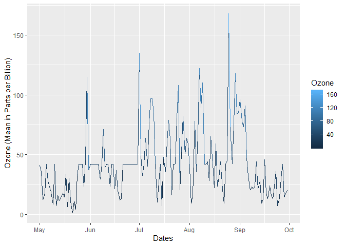

``` r
ggplot(air, aes(air$Dates, air$Wind, color = air$Wind))+geom_line()+xlab("Dates")+ylab("Windspeed (mph)")+labs(color = "Windspeed (mph)")
```

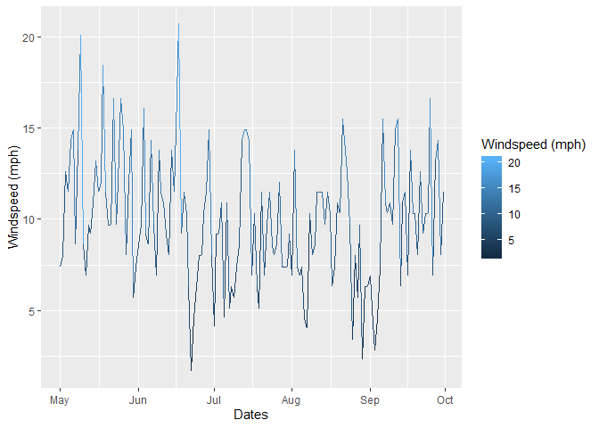

``` r
ggplot(air, aes(air$Dates, air$Temp, color = air$Temp))+geom_line()+xlab("Dates")+ylab("Temperature (F)")+labs(color = "Temperature (F)")
```

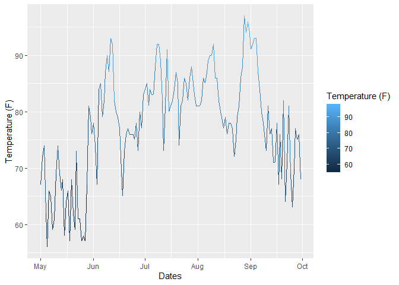

``` r
ggplot(air, aes(air$Dates, air$Solar.R, color = air$Solar.R))+geom_line()+xlab("Dates")+ylab("Solar Radiation (frequency)")+labs(color = "Solar Radiation")
```

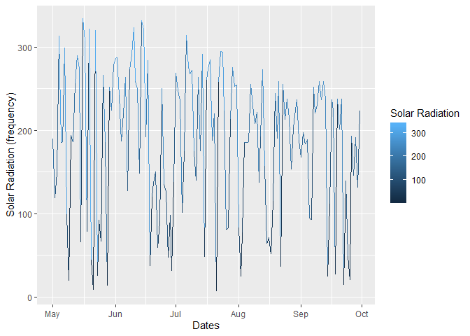

A combined line plot of all the variables lets us see the relationships among one another.

``` r
air2 = subset(air, select = -c(Month, Day))
air2$Wind = air2$Wind*10
air2 = gather(air2, Variable, Value, -Dates)
air2$Value = round(air2$Value, digits = 2)

ggplot(air2,aes(air2$Dates, air2$Value, color = air2$Variable))+geom_line()+xlab("Date")+ylab("Value")+labs(color = "Variable")
```

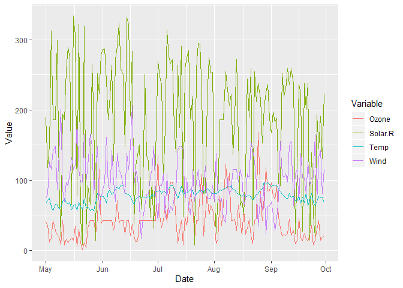

A heatmap allows us an alternative visualization.

``` r
ggplot(air2, aes(air2$Dates, air2$Variable))+geom_tile()+ geom_raster(aes(fill = Value))+xlab("Date")+ylab("Variable")+labs(color = "Value")
```

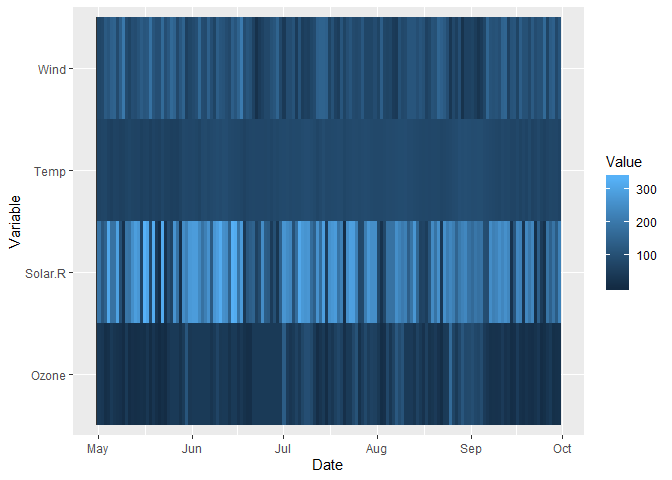

``` r
ggplot(air2, aes(air2$Value, air2$Variable))+stat_density(aes(fill = stat(count)), geom = "raster", position = "identity")+xlab("Value")+ylab("Variable")
```

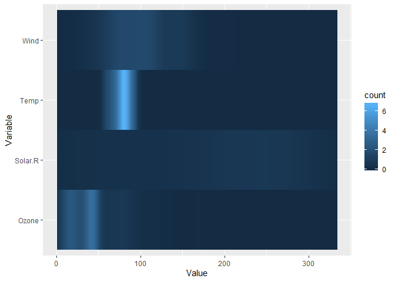

Last is a scatterplot showing once again the relationship between our variables.

``` r
air = data.frame(airquality)

for(i in 1:ncol(air)){
  air[is.na(air[,i]), i] <- mean(air[,i], na.rm = TRUE)
}

dates = as.Date(with(air, paste(Month, Day,sep="-")), "%m-%d")
year(dates) = 1973
air$Dates = dates


ggplot(air, aes(air$Wind, air$Temp, color = air$Solar.R, size = air$Ozone))+geom_jitter()+ xlab("Windspeed (mph)")+ylab("Temperature (F)")+labs(color = "Solar Radiation")
```

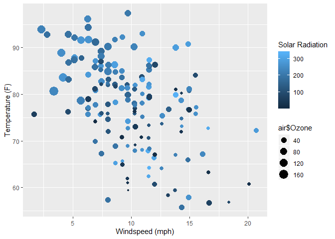

Question 1 - "Do you see any patterns after exploring the data?"

I would say the most notable pattern that I see are from the combined lineplot showing that while each of the variables had volatile peaks and troughs, only solar radiation seemed to have a steady decline throughout the year, while all the other variables ended fairly close to where they started. Its range also got smaller which made it more consistent by the end of the year. This can also be seen in the heatmap, where the gradient seemed to stay rather consistent for each variable except Solar Radiation which ends slightly dimmer. I also notice that in the scatterplot, an observable cluster of data in the top left corner shows that the slower speed the wind travels, the higher temperature the air was. Not only that, but the dots are also larger in this cluster which tells us that the mean ozone is higher as well.

Question 2 - What was the most useful visualization?

I believe the scatterplot is the most useful visualization because it gives the most information and is also the easiest to read. While it may have not been the most complex visualization to create, it gives a very quick and simple look at each specific variable in the dataset. Clusters are easy to spot as well as linearity and the distribution of the data as a whole.
